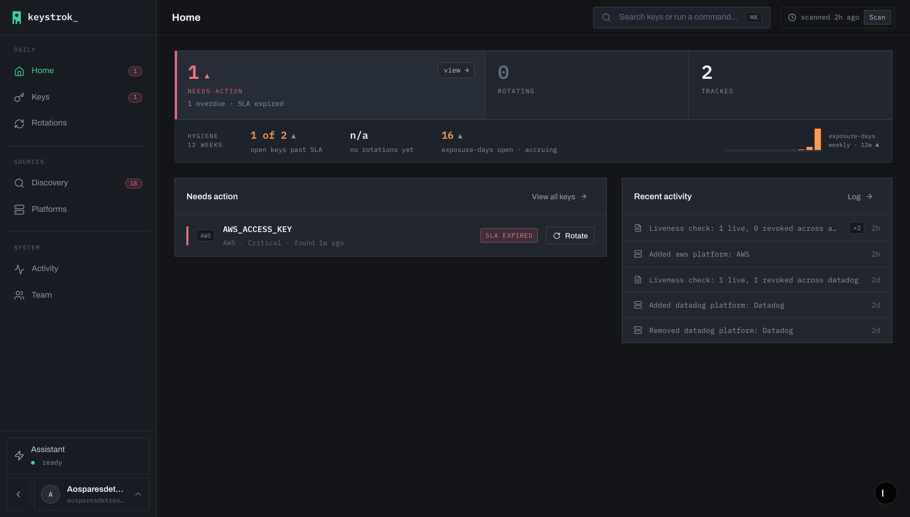
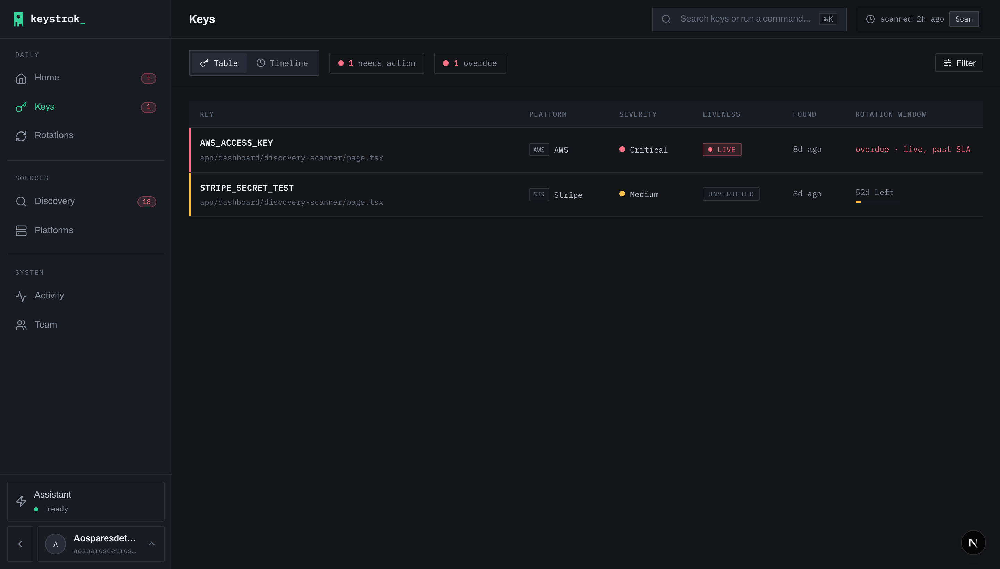
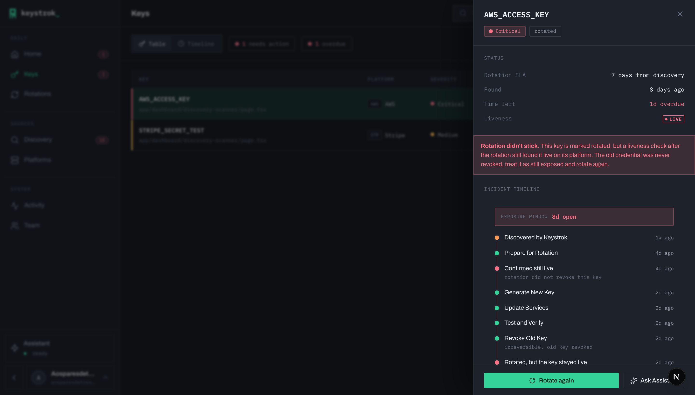
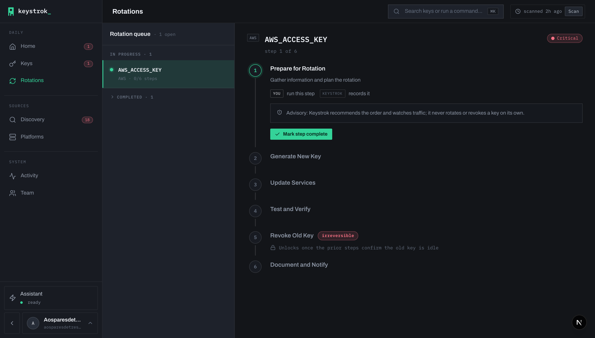
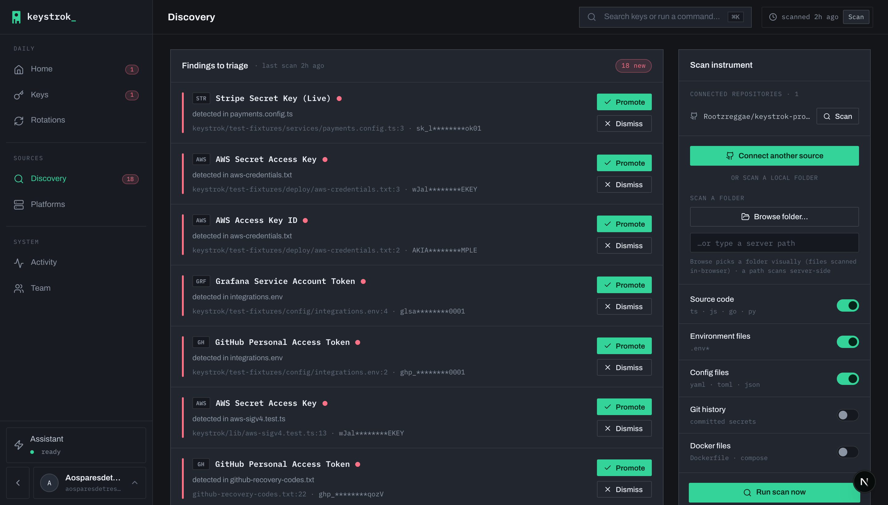
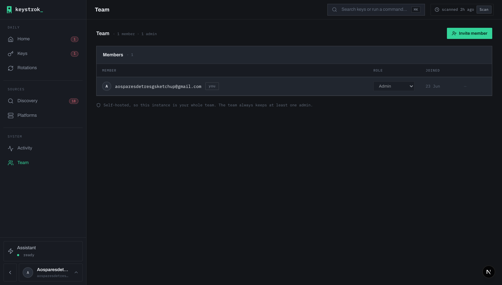

# Keystrok

Find exposed API keys in your code, track them, and rotate them safely. Keystrok is a self-hostable security tool for developers who want to get on top of leaked secrets without handing their keys to a third party.

*Also mirrored on [Codeberg](https://codeberg.org/windgodfist/keystrok).*

**Advisory, never automated.** Keystrok ranks what actually needs attention and walks you through each rotation step, but it never rotates or revokes a key on its own. The irreversible actions stay in your hands. It also never claims to know a key's real age: every deadline is anchored to when a key was *discovered*, not a guessed creation date.



## What it does

- **Discovery**: scan a GitHub repo (via a GitHub App) or a local folder for exposed secrets (AWS, Stripe, GitHub, observability platforms, and more). Findings are stored hashed/masked, never as plaintext.
- **Ledger**: promote real findings to a tracked inventory. Each key gets a rotation deadline from its severity, counted from discovery.
- **Guided rotation**: step-by-step, operator-gated walkthroughs. The revoke step is irreversible by confirmation.
- **Platform validation**: connect a platform (Datadog, Grafana, Stripe, GitHub, …) to check whether a leaked key is still live. A dead key is far less urgent than a working one.
- **Bring-your-own AI assistant** *(optional)*: a chat that reasons over your key *metadata* (never the secret values) to answer "what should I rotate first?". Works with Anthropic, any OpenAI-compatible endpoint, or a local model via Ollama.
- **Teams**: self-hosted, so one instance is one team. Invite members, gate the irreversible actions to admins, and keep a shared, attributed workspace.

## Screenshots

| | |
| --- | --- |
|  **The ledger**: every tracked key with its liveness, severity, and rotation window, one urgency signal per row. |  **Key detail**: where it was found, a masked preview, honest provenance, and a per-key incident timeline. |
|  **Guided rotation**: run each step yourself; the revoke step is admin-gated and irreversible. |  **Discovery**: scan a Git source or local folder, then triage findings into the ledger. |
|  **Team**: invite members, set roles, and manage access from an admin-only tab. | |

## Stack

- **Next.js 15** (App Router) + React 19, TypeScript
- **NextAuth v5**: magic-link (email) authentication
- **Prisma** ORM on **PostgreSQL**
- **Tailwind CSS** + a square, terminal-inspired design system (`docs/DESIGN_SYSTEM.md`)
- Secrets encrypted at rest (AES-256-GCM); SSRF-guarded outbound calls

## Quick start (self-host)

The fastest path is the bundled Docker stack, with app + Postgres + a local mail catcher, no external services:

```bash
cp .env.example .env
echo "NEXTAUTH_SECRET=$(openssl rand -base64 32)" >> .env
echo "ENCRYPTION_KEY=$(openssl rand -base64 32)"  >> .env
echo "ALLOWED_EMAILS=you@example.com"             >> .env   # invite-only
docker compose up --build
# App: http://localhost:3001   Magic-link inbox: http://localhost:8025
```

Prefer a prebuilt image? `docker compose pull && docker compose up` uses the published `ghcr.io/rootzreggae/keystrok` instead of building. See [`DEPLOYMENT.md`](DEPLOYMENT.md) for the bring-your-own-infra path (managed Postgres + SMTP).

## Local development

```bash
npm install
cp .env.example .env.local
npx prisma generate
npx prisma db push
npm run dev -- -p 3001    # http://localhost:3001
```

### Key environment variables

| Variable | Purpose |
| --- | --- |
| `DATABASE_URL` | PostgreSQL connection string |
| `NEXTAUTH_URL` / `NEXTAUTH_SECRET` | App URL + session signing secret |
| `ENCRYPTION_KEY` | AES-256-GCM key for encrypting stored credentials (`openssl rand -base64 32`) |
| `EMAIL_SERVER_*` / `EMAIL_FROM` | SMTP for magic-link email |
| `ALLOWED_EMAILS` | Invite-only sign-in allowlist |

## Project layout

- `app/`: Next.js App Router (`(authenticated)/` routes, `api/` handlers, `auth/` pages)
- `lib/`: auth, crypto, the scanner, rotation policy, integrations
- `components/`: the UI component system
- `prisma/schema.prisma`: database schema (source of truth)
- `docs/`: design & API references

## On how this is made

I'm a product designer who has spent years on developer and observability tools (among them Grafana's Frontend Observability and APM). I build Keystrok with AI as my engineering partner. The product, what it does, what it deliberately *won't* do (it never rotates a key on its own), and how it should feel to use, is mine. The implementation is a collaboration, written and reviewed with AI in the loop.

I mention the AI part plainly, not defensively. Judge the work, not the method: the self-host path is verified end to end, secrets are encrypted at rest, rotation is advisory and operator-gated, and the AI assistant only ever sees key *metadata*, never the secret values. Find a bug or a bad call? Open an issue. I'd rather fix it than defend it.

## License

MIT: see [LICENSE](LICENSE).
